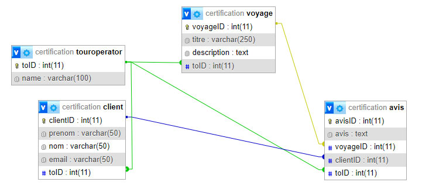

# 🌍 Certification PHP - API REST Tour Operator

**Romain Senger**  

---

## 🎓 Enoncé du projet

Développement d’une application web permettant à des **tours-opérateurs** de gérer les **avis de leurs clients** sur les voyages qu’ils proposent.

> Ce projet repose sur une API RESTful en PHP documentée via Swagger UI.

---

## 🧩 Fonctionnalités de l’application

### 👥 Gestion des clients
- 🔹 Créer, lire, modifier, supprimer un client
- 🔒 Clients pré-enregistrés non modifiables via Swagger

### ✈️ Gestion des voyages
- 🔹 Créer, lire, modifier, supprimer un voyage
- 🔒 Voyages pré-enregistrés non modifiables via Swagger

### 📝 Gestion des avis
- 🔹 Créer, lire, modifier, supprimer un avis
- 🔒 Avis pré-enregistrés non modifiables via Swagger
- 🔎 Lecture enrichie : inclut client et voyage associés

---

## 🛠️ Architecture technique

- **Back-end** : PHP orienté objet
- **Base de données** : MySQL
- **Documentation** : Swagger UI via annotations PHP
- **Déploiement** : hébergement mutualisé chez Hostinger

---

## 🧱 Structure de la base de données

La base de données est composée de **4 tables relationnelles** :

### `tourOperator`
- `toID` (PK)
- `name`

### `client`
- `clientID` (PK)
- `prenom`, `nom`, `email`
- `toID` (FK → tourOperator)

### `voyage`
- `voyageID` (PK)
- `titre`, `description`
- `toID` (FK → tourOperator)

### `avis`
- `avisID` (PK)
- `avis`
- `voyageID` (FK → voyage)
- `clientID` (FK → client)
- `toID` (FK → tourOperator)

📌 **Schéma conceptuel :**



---

## 📂 Organisation du dépôt

```bash
AGENCE_VOYAGE/
│
├── 📁 api/                    # Dossier contenant les routes de l'API REST (CRUD)
│
├── 📁 classes/                # Classes PHP : modèles représentant les entités (Client, Voyage, etc.)
│
├── 📁 config/                 # Fichiers de configuration (ex: _config.php)
│
├── 📁 swagger-ui-master/     # Interface Swagger UI pour tester l'API (docs interactives)
│
├── 📁 utilities/             # Fonctions utilitaires (helpers, JSON response, etc.)
│
├── 📁 vendor/                # Dépendances installées via Composer (Swagger, etc.)
│
├── .gitignore                # Fichier pour ignorer des fichiers/dossiers dans Git
├── .htaccess                 # Règles Apache (url rewriting, sécurité, etc.)
├── composer.json             # Déclaration des dépendances PHP
├── composer.lock             # Versions précises des dépendances
├── index.php                 # Point d'entrée principal de l’API
├── swagger-bootstrap.php     # Bootstrap Swagger

```

---

## 📖 Documentation API (Swagger)

L'interface Swagger est disponible à cette adresse :

🔗 [https://romain-senger.fr](https://romain-senger.fr)

---

## 🚫 Restrictions appliquées

| Entité       | Restriction Swagger |
|--------------|---------------------|
| `client`     | clientID 1 et 2 non modifiables/supprimables |
| `voyage`     | voyageID 1 et 2 non modifiables/supprimables |
| `avis`       | avisID 1 et 2 non modifiables/supprimables |
| Global       | Seul `toID = 1` autorisé pour opérations via Swagger |

---

## 🧪 Données de démonstration

### ✅ `tourOperator`
- ID : 1
- Nom : `tour operator 1`

### ✅ `client`
1. Prénom : prénom 1 / Nom : nom 1 / Email : email1@mail.com
2. Prénom : prénom 2 / Nom : nom 2 / Email : email2@mail.com

### ✅ `voyage`
1. Titre : voyage 1 / Description : description du voyage 1  
2. Titre : voyage 2 / Description : description du voyage 2

### ✅ `avis`
1. Avis 1 → voyage 1 / client 1  
2. Avis 2 → voyage 2 / client 2

---

## 🚀 Déploiement

Le projet est actuellement hébergé et accessible via :

🌐 **[https://romain-senger.fr](https://romain-senger.fr)**

---

## ✅ Fournitures attendues

- ✔️ Lien vers l'API déployée
- ✔️ Code source en PHP
- ✔️ Fichier SQL de la base de données
- ✔️ Swagger fonctionnel
- ✔️ Schéma BDD (conceptuel & physique)
- ✔️ Application testable sur serveur distant

---

## 🧠 Connaissances mobilisées

- Programmation PHP orientée objet
- SQL & modélisation relationnelle
- Swagger & OpenAPI
- API REST & bonnes pratiques
- Déploiement sur serveur mutualisé

---

## 👨‍💻 Réalisé par

**Romain Senger**
